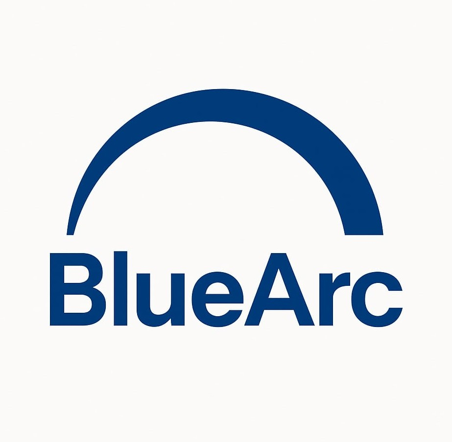

# BlueArc - Business Growth Solutions

A modern, responsive React.js website for BlueArc - a professional B2B services company specializing in lead generation, web development, and data analysis solutions.

## 🚀 About BlueArc

BlueArc helps businesses accelerate growth through targeted client acquisition, data-driven insights, and professional web development. We provide comprehensive solutions to help you reach your ideal customers and scale your operations efficiently.

## ✨ Features

- **Modern React.js Architecture** - Built with latest React best practices
- **Fully Responsive Design** - Optimized for all devices and screen sizes
- **Interactive Service Cards** - Expandable service sections for better UX
- **SEO Optimized** - Proper meta tags and structured data
- **Fast Performance** - Optimized loading and smooth animations
- **Professional UI/UX** - Clean, business-focused design

## 🛠 Services Offered

### 🔍 Lead Generation & Client Acquisition
- Verified C-level & decision-maker contacts
- Customized lead lists by industry & region
- LinkedIn & email outreach support
- Appointment setting & meeting arrangements

### 📊 B2B Data Services
- Company & contact database building
- Direct phone numbers, emails & LinkedIn profiles
- Market research & industry-specific lists
- On-demand data delivery

### 💻 Web Development
- Business websites & landing pages
- Custom portfolio websites
- CRM & lead capture integration
- Mobile-friendly, SEO-ready design

### 📈 Data Analysis & BI Reporting
- Sales & marketing performance analysis
- KPI tracking & reporting
- Interactive BI dashboards
- Forecasting & trend analysis

## 🛠 Tech Stack

- **Frontend Framework**: React.js 18+
- **Styling**: CSS3 with modern features
- **Icons**: Font Awesome
- **Build Tool**: Create React App
- **Deployment**: Ready for Netlify, Vercel, or GitHub Pages
