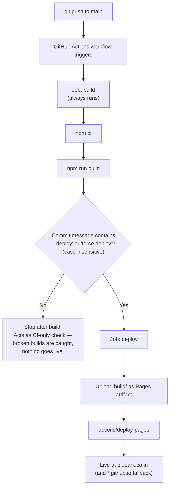

# BlueArk Website — Hosting & CI/CD Deployment Report

**Date:** 2026-08-11
**Author:** Claude Code (analysis on behalf of the BlueArk team)
**Status:** Recommendation — pending approval to implement

## 1. Objective

Deploy the `blueark-portfolio` React app (Create React App, static SPA, no backend) to a **free** hosting provider, wired to a **CI/CD pipeline** that only deploys when a push's commit message contains a specific trigger phrase — `--deploy` or `force deploy` — rather than on every push to `main`.

## 2. Current state (as found)

| Fact | Detail |
|---|---|
| Repo | `github.com/Marudham/bluearc-ui`, **public**, default branch `main` |
| App type | Create React App — pure static build output (`npm run build` → `build/`), no server, no API |
| Existing hosting | **GitHub Pages is already live** at `https://marudham.github.io/bluearc-ui/`, serving from a `gh-pages` branch, built via the `gh-pages` npm package's manual `npm run deploy` script. Last manual deploy: Oct 5, 2025. |
| Custom domain | Not yet configured on GitHub Pages (`cname: null`). Target domain from the rebrand: `blueark.co.in`. |
| Existing automation | **None** — no `.github/workflows/` directory exists. All deploys so far have been manual (`npm run deploy` from a developer's machine). |
| `package.json` | Already has `homepage: "."` (relative paths — portable to any static host/subpath) and `predeploy`/`deploy` scripts targeting `gh-pages`. |

The site's requirements are minimal: serve static files over HTTPS, support a custom domain, and nothing that needs server-side rendering, redirects/rewrites, functions, or a database. This significantly widens the field of viable free hosts and makes the choice mostly about **CI/CD ergonomics, bandwidth limits, and terms-of-service fit for a commercial site**, not raw capability.

## 3. Options evaluated

| Provider | Cost (free tier) | Bandwidth / build limits | Custom domain + HTTPS | Native commit-message gating | Commercial-use restriction | New account needed? |
|---|---|---|---|---|---|---|
| **GitHub Pages** | Free (public repos) | Soft ~100 GB/mo, no hard build-minute cap when built via Actions | Yes, free (Let's Encrypt) | No — implement in GitHub Actions (full control) | None | **No** — already in use |
| **Cloudflare Pages** | Free | **Unlimited** bandwidth & requests; 500 builds/mo | Yes, free, fastest DNS integration if domain moves to Cloudflare | No native support — implement via Actions + Wrangler | None | Yes |
| **Netlify** | Free ("Starter") | 100 GB/mo bandwidth, 300 build min/mo | Yes, free | **Yes** — native "Ignore Build" hook script can check commit message | None | Yes |
| **Vercel** | Free ("Hobby") | ~100 GB/mo (fair-use) | Yes, free | **Yes** — native "Ignored Build Step" | ⚠️ **Hobby plan ToS restricts use to personal, non-commercial projects.** BlueArk is a company site — using Hobby tier is a ToS gray area and Vercel has enforced this before. | Yes |
| **Firebase Hosting** | Free ("Spark") | 10 GB storage, **360 MB/day** transfer (~10.8 GB/mo — noticeably tighter than the rest) | Yes, free | No native support — implement via Actions + Firebase CLI | None | Yes |
| **Render (Static Site)** | Free | 100 GB/mo bandwidth | Yes, free | No native support — needs a Deploy Hook URL called from Actions | None | Yes |

### Why the commit-message gate changes the calculus

Netlify and Vercel both offer a native "ignore this build" hook exactly suited to this ask — but achieving the *same* logic on GitHub Pages, Cloudflare Pages, Render, or Firebase just means writing one `if:` condition in a GitHub Actions workflow. Since the gating logic ends up living in Actions either way for the non-native options, and since **GitHub Actions can drive the exact same conditional logic identically well for every provider**, the native-hook feature stops being a deciding advantage — it just saves ~10 lines of YAML.

That neutralizes Netlify/Vercel's one structural edge, which leaves the decision to: cost, limits, ToS fit, and setup friction — where GitHub Pages already wins on the last point by being live today.

## 4. Recommendation

### Primary: **GitHub Pages, deployed via GitHub Actions**

- **Zero new accounts, zero new secrets to manage** — it uses the repo's built-in `GITHUB_TOKEN`, and Pages is already enabled on this exact repo.
- **No commercial-use restriction** (unlike Vercel Hobby).
- Free custom domain + auto-renewing HTTPS, which covers the `blueark.co.in` requirement.
- The commit-message gate is fully self-contained in the workflow file — no dependency on a third party's build-skip feature.
- One recommended change from the current setup: migrate from the **legacy branch-based Pages build** (`gh-pages` branch + `peaceiris/actions-gh-pages`) to GitHub's **native Actions-based Pages deployment** (`actions/deploy-pages`). This drops the extra `gh-pages` branch entirely, shows deployments in the repo's "Environments" tab with history/rollback, and is GitHub's current recommended path. It requires a one-time change in **Settings → Pages → Build and deployment → Source → "GitHub Actions"** (see §7).

### Secondary / fallback: **Cloudflare Pages**

If bandwidth ever becomes a concern (unlikely for a marketing site, but Cloudflare's free tier is uncapped) or the domain is later moved to Cloudflare DNS for performance reasons, Cloudflare Pages is the strongest alternative: no commercial restriction, unlimited bandwidth, and the same Actions-based commit-message gating pattern applies unchanged — only the final deploy step swaps to `wrangler pages deploy`.

**Not recommended:** Vercel Hobby (ToS conflict for a commercial site — would require their paid Pro plan to be compliant) and Firebase Spark (transfer cap is the tightest of the group for no added benefit here).

## 5. Proposed CI/CD pipeline



Two jobs, always in this order:

1. **`build`** — runs on *every* push to `main`. Installs dependencies, runs `npm run build`. This is free continuous-integration signal: if a commit breaks the build, you find out immediately regardless of whether it was meant to deploy.
2. **`deploy`** — runs only if `build` succeeded **and** the triggering commit message matched the trigger phrase. Publishes the already-built `build/` output to GitHub Pages.

This means routine commits (copy tweaks, refactors, WIP) get validated but stay off the live site, and a deploy only happens when a commit is deliberately tagged, e.g.:

```
git commit -m "Update hero copy and pricing — force deploy"
git commit -m "fix: footer year bug --deploy"
```

## 6. Trigger convention

- Match is **case-insensitive substring search** against the full commit message (`grep -iE -- '--deploy|force deploy'`), so `--Deploy`, `FORCE DEPLOY`, `Force-Deploy...` variants aren't accidentally missed by a casing mismatch.
- Only the **head commit's** message of the push is checked — if you squash-merge a PR, make sure the squash commit message (which you control at merge time on GitHub) contains the trigger phrase.
- A push with multiple commits: GitHub Actions' `push` event only exposes `head_commit`, so only the message of the most recent commit in the push is evaluated. This is worth remembering if you `git push` a batch of commits at once — put the trigger phrase in the last one.

## 7. Implementation plan (ready to execute on approval)

### One-time repo setting change
```
Settings → Pages → Build and deployment → Source → "GitHub Actions"
```
This can also be done via API (`gh api -X PUT repos/Marudham/bluearc-ui/pages -f build_type=workflow`) — I can run this for you on approval, or you can click it manually.

### Workflow file — `.github/workflows/deploy.yml`

```yaml
name: Deploy to GitHub Pages

on:
  push:
    branches: [main]
  workflow_dispatch: {}   # allows manual "Run workflow" from the Actions tab too

permissions:
  contents: read
  pages: write
  id-token: write

concurrency:
  group: pages
  cancel-in-progress: false

jobs:
  build:
    runs-on: ubuntu-latest
    outputs:
      should_deploy: ${{ steps.gate.outputs.should_deploy }}
    steps:
      - uses: actions/checkout@v4

      - uses: actions/setup-node@v4
        with:
          node-version: 20
          cache: npm

      - run: npm ci
      - run: CI=false npm run build

      - name: Check for deploy trigger in commit message
        id: gate
        run: |
          MSG=$(cat <<'EOF'
          ${{ github.event.head_commit.message }}
          EOF
          )
          if echo "$MSG" | grep -qiE -- '--deploy|force deploy'; then
            echo "Trigger phrase found — will deploy."
            echo "should_deploy=true" >> "$GITHUB_OUTPUT"
          else
            echo "No trigger phrase — build-only run, skipping deploy."
            echo "should_deploy=false" >> "$GITHUB_OUTPUT"
          fi

      - name: Upload Pages artifact
        if: steps.gate.outputs.should_deploy == 'true'
        uses: actions/upload-pages-artifact@v3
        with:
          path: build

  deploy:
    needs: build
    if: needs.build.outputs.should_deploy == 'true'
    runs-on: ubuntu-latest
    environment:
      name: github-pages
      url: ${{ steps.deployment.outputs.page_url }}
    steps:
      - name: Deploy to GitHub Pages
        id: deployment
        uses: actions/deploy-pages@v4
```

Notes on this file:
- `workflow_dispatch` is included so you (or I) can also trigger a deploy manually from the Actions tab UI, independent of the commit-message gate — useful for a hotfix or the very first deploy.
- `concurrency` prevents two pushes racing to deploy at once.
- The `build` job always runs and always uploads build output as an artifact when triggered by design also serving as an ordinary CI check on every push, at basically no extra cost (GitHub Actions gives 2,000 free build minutes/month on public repos — this uses well under a minute per run).

### Custom domain (`blueark.co.in`)

1. In **Settings → Pages → Custom domain**, enter `blueark.co.in` (or `www.blueark.co.in`, whichever should be canonical) — GitHub will commit a `CNAME` file into the Pages deployment automatically going forward.
2. At your DNS registrar for `blueark.co.in`, add:
   - If pointing the **apex domain** (`blueark.co.in` itself): four `A` records to GitHub Pages' IPs — `185.199.108.153`, `185.199.109.153`, `185.199.110.153`, `185.199.111.153`.
   - If pointing a **subdomain** (e.g. `www.blueark.co.in`): a `CNAME` record to `marudham.github.io`.
3. Tick **"Enforce HTTPS"** once DNS has propagated and GitHub has issued the certificate (usually minutes to a few hours).

I don't have access to your domain registrar, so this step needs to be done by you (or share registrar access and I can walk through it live).

## 8. Manual escape hatch

The existing `npm run deploy` (via `gh-pages` CLI) still works standalone from a developer machine if you ever need to push a change without going through git/CI at all. Once the Pages source is switched to "GitHub Actions" (§7), that script would need updating to stop targeting the now-unused `gh-pages` branch — happy to fold that into the same change.

## 9. Self-service implementation steps

You've chosen to run these yourself. Three independent walkthroughs below — do them in order (9.2 before 9.3, since the domain step needs Pages already serving via Actions).

### 9.1 Confirm / customize the trigger phrases

The default is `--deploy` or `force deploy`, case-insensitive, matched anywhere in the commit message. Nothing to do if that's fine as-is. To change it later:

1. Open `.github/workflows/deploy.yml` (created in step 9.2 below).
2. Find this line inside the `Check for deploy trigger in commit message` step:
   ```bash
   if echo "$MSG" | grep -qiE -- '--deploy|force deploy'; then
   ```
3. Add more alternatives by extending the `-E` regex with `|`. Example — also allow `[deploy]`:
   ```bash
   if echo "$MSG" | grep -qiE -- '--deploy|force deploy|\[deploy\]'; then
   ```
   (Regex special characters like `[`, `]`, `.`, `(`, `)` need a `\` in front if you want them matched literally.)
4. Before committing, test the pattern locally so you're not guessing:
   ```bash
   echo "Update pricing copy -- deploy" | grep -qiE -- '--deploy|force deploy' && echo MATCH || echo "NO MATCH"
   echo "Fix typo in footer"            | grep -qiE -- '--deploy|force deploy' && echo MATCH || echo "NO MATCH"
   ```
5. Commit and push the change to `.github/workflows/deploy.yml` like any other file (remember: this push itself won't deploy unless its own commit message also contains a trigger phrase).

### 9.2 Switch Pages to GitHub Actions, add the workflow, retire the old `gh-pages` script

**A. Change the Pages source (GitHub UI, one-time):**

1. Go to `https://github.com/Marudham/bluearc-ui`.
2. Click **Settings** (top nav of the repo, not your account settings).
3. In the left sidebar, under **Code and automation**, click **Pages**.
4. Under **Build and deployment → Source**, open the dropdown (currently "Deploy from a branch") and select **GitHub Actions**.
5. It saves automatically — no separate Save button. The page will show "GitHub Actions" as the selected source.

**B. Add the workflow file:**

1. In your local clone, create the folder: `.github/workflows/` (if it doesn't exist).
2. Create a new file at `.github/workflows/deploy.yml` with exactly this content:

   ```yaml
   name: Deploy to GitHub Pages

   on:
     push:
       branches: [main]
     workflow_dispatch: {}   # allows manual "Run workflow" from the Actions tab too

   permissions:
     contents: read
     pages: write
     id-token: write

   concurrency:
     group: pages
     cancel-in-progress: false

   jobs:
     build:
       runs-on: ubuntu-latest
       outputs:
         should_deploy: ${{ steps.gate.outputs.should_deploy }}
       steps:
         - uses: actions/checkout@v4

         - uses: actions/setup-node@v4
           with:
             node-version: 20
             cache: npm

         - run: npm ci
         - run: CI=false npm run build

         - name: Check for deploy trigger in commit message
           id: gate
           run: |
             MSG=$(cat <<'EOF'
             ${{ github.event.head_commit.message }}
             EOF
             )
             if echo "$MSG" | grep -qiE -- '--deploy|force deploy'; then
               echo "Trigger phrase found — will deploy."
               echo "should_deploy=true" >> "$GITHUB_OUTPUT"
             else
               echo "No trigger phrase — build-only run, skipping deploy."
               echo "should_deploy=false" >> "$GITHUB_OUTPUT"
             fi

         - name: Upload Pages artifact
           if: steps.gate.outputs.should_deploy == 'true'
           uses: actions/upload-pages-artifact@v3
           with:
             path: build

     deploy:
       needs: build
       if: needs.build.outputs.should_deploy == 'true'
       runs-on: ubuntu-latest
       environment:
         name: github-pages
         url: ${{ steps.deployment.outputs.page_url }}
       steps:
         - name: Deploy to GitHub Pages
           id: deployment
           uses: actions/deploy-pages@v4
   ```

3. Stage, commit, and push it:
   ```bash
   git add .github/workflows/deploy.yml
   git commit -m "Add CI/CD pipeline for conditional GitHub Pages deploy -- deploy"
   git push
   ```
   Note the `-- deploy` at the end of that commit message — that's deliberate, so this very push does the first automated deploy and you can confirm everything works end-to-end. If you'd rather not deploy yet, drop it from the message and trigger the first run manually instead (next step).
4. Verify it ran: go to the repo's **Actions** tab → you should see the "Deploy to GitHub Pages" workflow listed and running/completed. Click into it to see both the `build` and (if triggered) `deploy` jobs and their logs.
5. To trigger a run manually at any time without a commit: **Actions tab → "Deploy to GitHub Pages" (left sidebar) → "Run workflow" button → Run workflow**. This always deploys, bypassing the commit-message check (useful for the very first run, or a hotfix).
6. Once the `deploy` job finishes, its log (or the Actions tab's environment link) shows the live URL — confirm `https://marudham.github.io/bluearc-ui/` is serving the latest build.

**C. Retire the old branch-based deploy script:**

1. Remove the now-unused dependency:
   ```bash
   npm uninstall gh-pages
   ```
   This updates both `package.json` and `package-lock.json` for you.
2. Open `package.json` and delete the `predeploy` and `deploy` entries from `"scripts"` (they pushed to the `gh-pages` branch, which is no longer what serves the site):
   ```diff
     "scripts": {
       "start": "react-scripts start",
       "build": "set CI=false && react-scripts build",
       "test": "react-scripts test",
       "eject": "react-scripts eject",
   -   "predeploy": "npm run build",
   -   "deploy": "gh-pages -d build"
     },
   ```
3. Commit:
   ```bash
   git add package.json package-lock.json
   git commit -m "Remove gh-pages package now that deploys run via GitHub Actions"
   git push
   ```
4. **Optional cleanup**, only after you've confirmed the Actions-based deploy has worked at least once: delete the old branch since nothing reads from it anymore:
   ```bash
   git push origin --delete gh-pages
   ```

### 9.3 Point `blueark.co.in` at GitHub Pages

Do this after 9.2 is confirmed working on the `github.io` URL.

**A. Add a `CNAME` file to the app so it ships with every build:**

1. Create a file at `public/CNAME` (plain text, no extension tricks) containing exactly one line:
   ```
   blueark.co.in
   ```
   (Create React App copies everything under `public/` into `build/` untouched, so this file will be present in every deploy automatically. This is a best-practice belt-and-suspenders step — the custom domain also gets stored in your repo settings in step B, but shipping the file too prevents the setting from ever being silently dropped.)
2. Commit and push it (`git add public/CNAME && git commit -m "Add CNAME for custom domain -- deploy" && git push`).

**B. Set the custom domain in GitHub:**

1. Repo → **Settings → Pages**.
2. Under **Custom domain**, type `blueark.co.in` and click **Save**.
3. GitHub will show a "DNS check in progress" or "unsuccessful" notice until step C below is done — that's expected at this point.

**C. Add DNS records at your domain registrar** (wherever `blueark.co.in` is registered — GoDaddy, Namecheap, BigRock, etc. all have a "DNS Management" or "Advanced DNS" screen; exact labels vary slightly):

   | Type | Host / Name | Value / Points to | Notes |
   |---|---|---|---|
   | A | `@` (or blank — means the bare/apex domain) | `185.199.108.153` | |
   | A | `@` | `185.199.109.153` | add as a 2nd A record, same host |
   | A | `@` | `185.199.110.153` | add as a 3rd A record, same host |
   | A | `@` | `185.199.111.153` | add as a 4th A record, same host |
   | CNAME | `www` | `marudham.github.io` | so `www.blueark.co.in` also resolves |

   Quick pointers for two common registrars:
   - **GoDaddy:** My Products → find the domain → **DNS** → **Add** a new record for each row above.
   - **Namecheap:** Domain List → **Manage** next to the domain → **Advanced DNS** tab → **Add New Record**.

   Remove any existing `A`/`CNAME`/parking records on `@`/`www` first if the registrar doesn't let you have duplicates for the same host.

4. Save the DNS changes. Propagation is often fast (minutes) but can take up to ~48 hours depending on the registrar/your ISP's DNS cache.

**D. Finish up in GitHub:**

1. Back in **Settings → Pages**, wait for the DNS check to go green (refresh the page, or it rechecks periodically on its own). You can check propagation yourself in the meantime with:
   ```bash
   dig +short blueark.co.in
   dig +short www.blueark.co.in
   ```
   — once these return the GitHub IPs / `marudham.github.io`, GitHub's check should pass shortly after.
2. Once green, tick **Enforce HTTPS**. This checkbox is disabled/grayed out until GitHub finishes issuing the certificate — if it's not clickable yet, wait 15–30 minutes and refresh.
3. Visit `https://blueark.co.in` and `https://www.blueark.co.in` to confirm both load the site over HTTPS.
